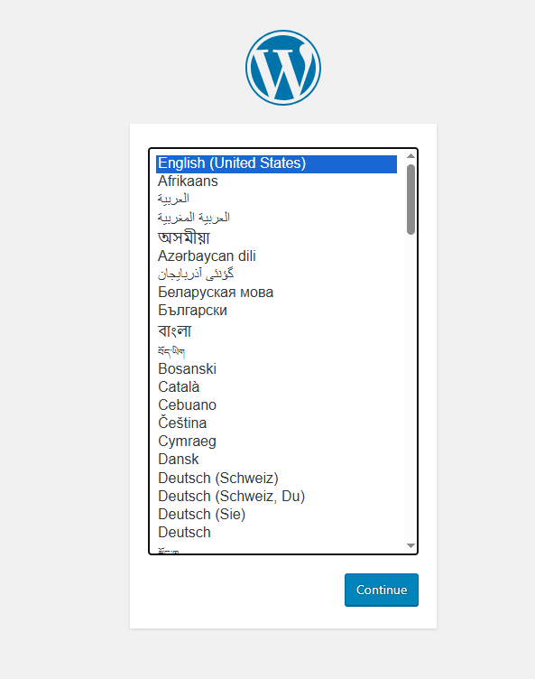

# Lab 2: Deploying WordPress and MySQL in Kubernetes

In this Lab, we will deploy wordpress and mysql in Kubernetes cluster without Persistent volumes. 
Note: This is not a production ready app. This is just for practice

## Create and apply the YAML files

#### Method 1: We created all the objects in one yaml file `wordpress.yaml` 
This is not recommended. This is just to show you that it is possible.
**Note:** If you are in a EKS cluster, modify the worpress service in the yaml file to the type **Loadbalancer** before applying it.

```bash
kubectl create -f wordpress-mysql.yaml
```
## Verify the objects created

To list all the objects created, use the command
```bash
kubectl get all
```

## Test the app
List the services and check the EXTERNAL-IP field to pick the external IP and the port of the wordpress service
```bash
kubectl get svc
```
You can access the app from your browser
```bash
http://<EXTERNAL-IP>:<PORT>
```
Note: If you used a service of Type **LoadBalancer**, you just need to use the Loadbalancer name provided.

## Clean up

Delete all the resources created
```bash
kubectl delete -f wordpress-mysql.yaml
```
#### Method 2: Create a single yaml file for each object
- Create the secret
- Create the Mysql deployment
- Create the Mysql service
- Create the Wordpress deployment
- Create the Wordpress service

Apply all the files
```bash
kubectl apply -f 01-secret.yaml
kubectl apply -f 02-mysql-deployment.yaml
kubectl apply -f 03-mysql-service.yaml
kubectl apply -f 04-wordpress-deployment.yaml
kubectl apply -f 05-wordpress-service.yaml
```

Verify and test the app just like iin the first method

Clean up to delete all the resources created 

## Expected result
